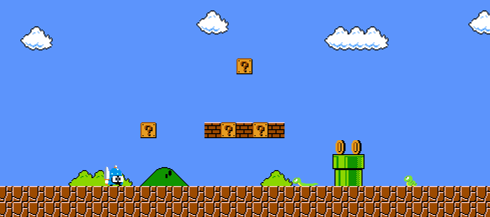
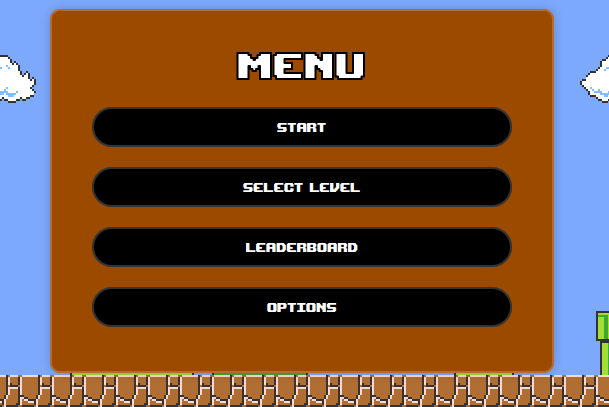
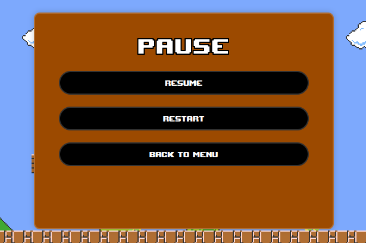
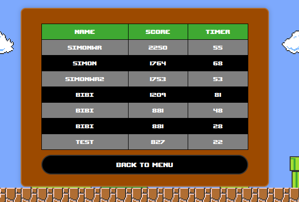
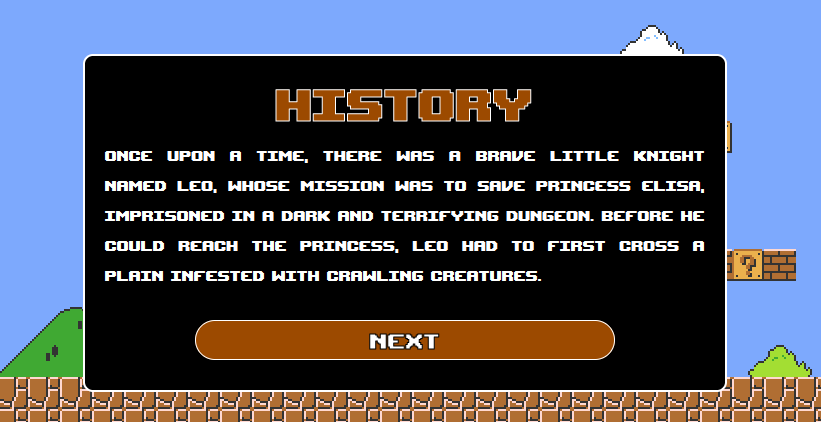
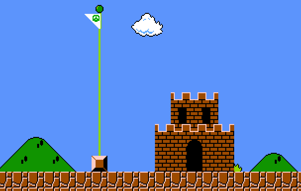
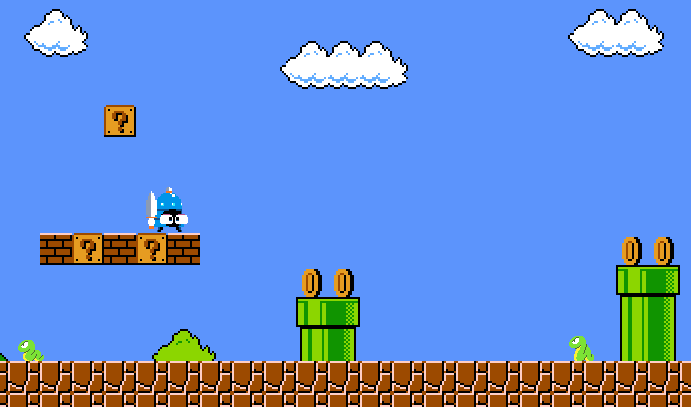
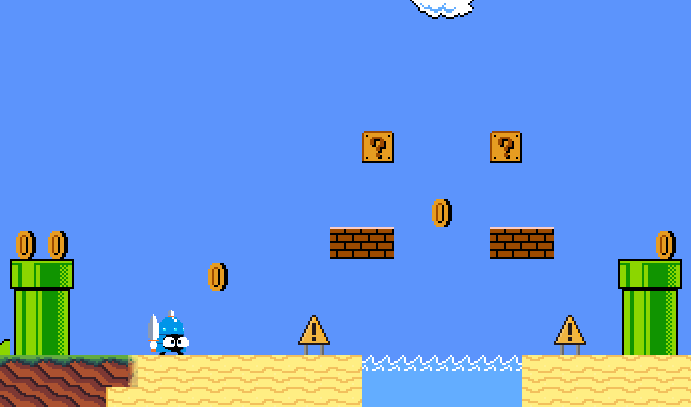
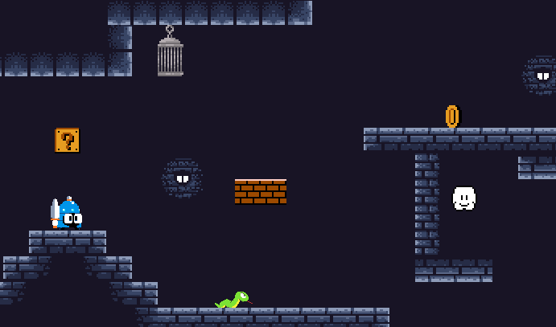

<h1 align="center">Jameson Snake</h1>

  

Jameson Snake is an exciting 2D platformer game created in JavaScript where you control a brave knight on a quest to rescue a princess held captive by Jameson's serpents. With three challenging levels, each with its own unique setting, your mission is to navigate through various obstacles and enemies to reach the final level and rescue the princess.
This project was carried out as part of the training (make-your-game) : [Zone01](https://zone01rouennormandie.org/).

## How to Play

To start playing Jameson Snake:
1. Launch the game server by running `go run server.go` or `go run .`.
2. Or `go build` and run it : `./main`.
3. Access the game on itch.io using the following link: [Jameson Snake](https://rexgame.itch.io/jameson-snake).

If the port 8080 is running, do this command : `fuser -k 8080/tcp`

Enjoy the thrilling adventure of Jameson Snake and embark on a quest to rescue the princess!

## Gameplay

### Controls:
- Move the character using the keyboard Q (going left) or D (going right), or using keyboard left arrow (←) and right arrow (→) arrow.
- Jump using the keyboard Z, or using keyboard up arrow (↑), or the spacebar. You can perform an air jump if you haven't jumped before being airborne.

### Menus:
- **Main Menu:** 
    - Start the game
    - Select your level
    - View the leaderboard
    - Option (not currently functional)
    

    
    

- **Pause Menu:**
    - Continue the game
    - Restart
    - Return to the main menu.
    

    
    

### Lives and Timer:
- You have three lives to complete the game.
- The game runs at 60 frames per second, providing smooth and responsive gameplay.
- A timer of 400 seconds adds an element of urgency, challenging you to complete the levels swiftly.

### Bonus:

- By taking this bonus, you will be able to perform a double jump.

    
    

## Leaderboard

After each victory in the game, it is possible to save your score, your time and a nickname. Subsequently, it is possible to see your position in relation to other players in the leaderboard of the main menu. The leaderboard is currently not accessible on [itch.io](https://rexgame.itch.io/jameson-snake).

    
    

Plusieurs actions peuvent vous permettre de récupérer des points : 
(coins * 10 + timer * 2) + (player.lives * 200)
- 1 coin : 10 points
- 1 suprise box : 50 points
- 1 live : 200 points
- le temps restant est multiplié par 2

### Record:

- Time record : 52 sec (all level)

## History

Each evolution of the story is displayed at the start or end of the level in this form : 

 

### Here is the complete story board :

&emsp;Once upon a time, there was a brave little knight named Leo, whose mission was to save Princess Elisa, imprisoned in a dark and terrifying dungeon. Before he could reach the princess, Leo had to first cross a plain infested with crawling creatures.

&emsp;As soon as he set foot on the plain, Leo was attacked by Jameson's snakes, formidable creatures with venomous scales. With his shining sword, the little knight managed to fend them off and move forward despite the obstacles. The path was filled with traps and enemies, but Leo never lost hope.

&emsp;Upon reaching the beach, Leo had to climb steep mountains and jump from platform to platform to progress. Jameson's snakes were still present, ready to attack at any moment. Despite the difficulty of the task, the little knight did not give up and continued to move forward, determined to save Princess Elisa.

&emsp;Finally, Leo arrived in front of the dungeon where the princess was being held captive. Jameson's snakes stood as threatening guards before him, but the little knight did not hesitate for a second. With courage and determination, he fought his way through the monsters and finally managed to free Princess Elisa.

&emsp;Princess Elisa was grateful to her savior, and the brave little knight Leo was proud to have accomplished his mission bravely. Together, they left the dark dungeon, ready to face new adventures to come.

## Objectives

- Advance through each level by moving towards the right until you reach the green flag, signaling the presence of a castle.
    

    
    

- To pass the entire game, you must pass 3 levels.
    

    
    
    
    

- In the final level, ensure to rescue the princess before reaching the green flag; otherwise, you'll need to restart the level if you have remaining lives.
    

    
    

## Co-developers

- [Delemos Dit Pereira Brice](https://github.com/BriceDelemosDitPereira)
- [Roy Simon](https://github.com/RoyS122)